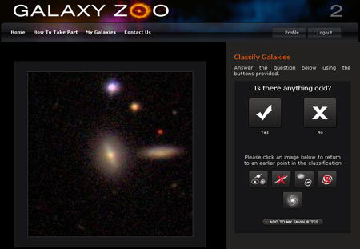
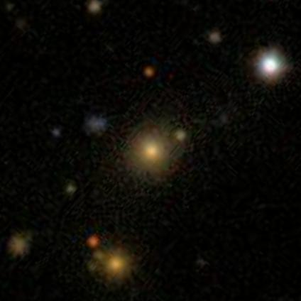
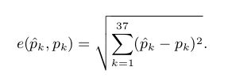
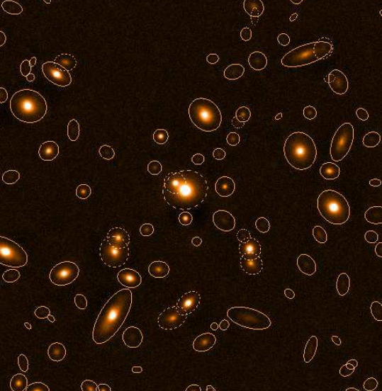
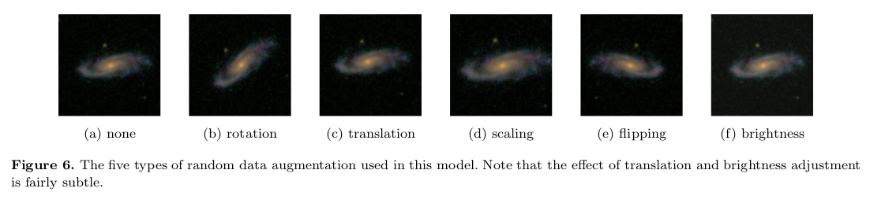
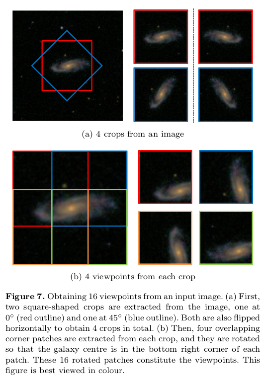
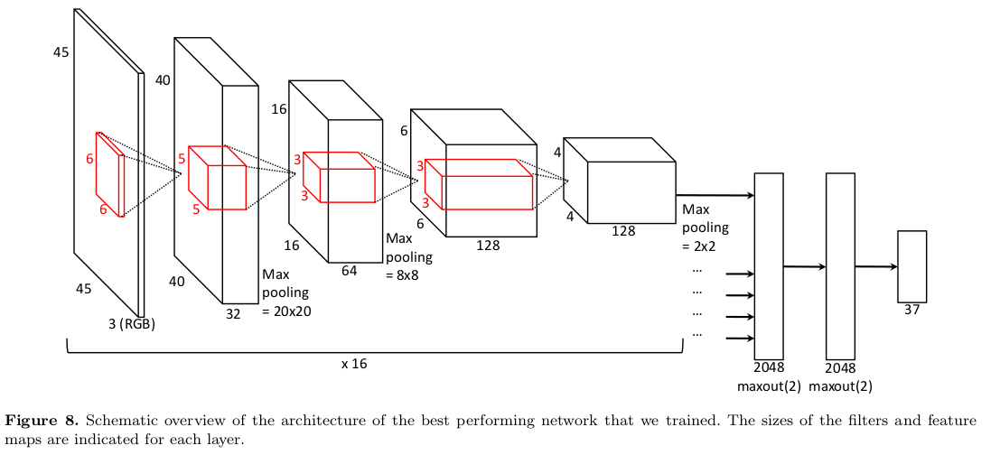
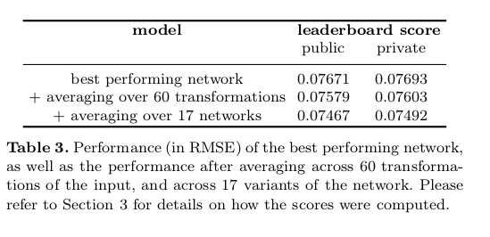

# What Is Galaxy Zoo?

----

 - All sky galaxy surveys produce more images than can be handled just by experts
 - It's 2011, better crowdsource it

## Galaxy Classification

 - Over 900000 galaxies classified in a few months
 - 37 categories arrived at by asking 11 questions 
 - After 40-50 users see a galaxy, the answers are aggregated and weighted vote fractions in the decision tree
 
----

# Competition Details

## Specifications

- Ran from December 20th, 2013 to April 4th, 2014
- 61,578 training images with vote fractions
- 79,975 test images
- 424 x 424 pixels
- Prize of $16,000

## Loss Function

- This is a regression problem!
- The answers to the first question should sum to 1
- Answers to the next questions to sum to their parent probability

- Note: We are measuring error against the what the crowd answered. A "good" model will have the same biases as the crowd

[//]: # https://www.kaggle.com/c/galaxy-zoo-the-galaxy-challenge/details/the-galaxy-zoo-decision-tree

# The Winning Solution

## 1st Place: Sander Dieleman

- Also won first place in the 2014 National Data Science Bowl with a team
- His approach was novel enough to get a paper in MNRAS and a job at DeepMind
- Co-author of Lasagne
- Second author on WaveNet, also on AlphaGo

## Preprocessing

- Cropped 424x424 to 207x207
- Downscaled to 3x to 69x69
- Centering was done by Petrosian radius
- Normalized in some images but not others
- Keeping color significantly improved the model, despite it being artificial

---

- Avoided cropping out the object interest by centering with SExtractor (Source Extractor)

## Data Augmentation

 
 - Rotating uniformly from 0 to 360
 - Translating uniformly -4 pixels to 4 pixels
 - Scaling log-uniformly from 1.3^-1 to 1.3
 - Flip as a Bernuolli event with probility 0.5
 - Brightness adjustment using an equation in the ImageNet paper
 - This is all being done on the CPU while the GPU trains the network

## Sander's Big Idea: Using Rotational Invariance

 - Step 1: Rotate image 45 degrees and flip both images (4 images)
 - Step 2: Crop each 67x67 image into 4 overlapping 45x45 images (4x4=16 images) 

# Network Architectures

- All 16 viewpoints are fed in at the same time to maximize parameter sharing
- Best single model has 4 square convolutional layers (6-5-3-3)
- More than 100 models were tested, 17 were included in the final ensemble
- Maxout are like groupwise ReLUs
- The 37 categories are rescaled to their unconditional probabilities

## Training

- 67(?) hours of training for the best model on a GTX 680
- Nesterov Momentum was used [//]: # Need to research this
- Learning rate of 0.04 (updated to 0.004 after 18M samples, then 0.0004 after 23M)
- Dropout was used during training to prevent overfitting

## Model Averaging

- Modeled across 17 architectures (they are all available on GitHub)
- For each model, averaged predictions across 60 different transforms 
- 10 rotations x 3 rescalings x 2 reflections
- It takes 4 hours to get a prediction from a single model

## How Did He Do?

- His single best network outperformed everything else

# Convolutional Neural Nets

# References

